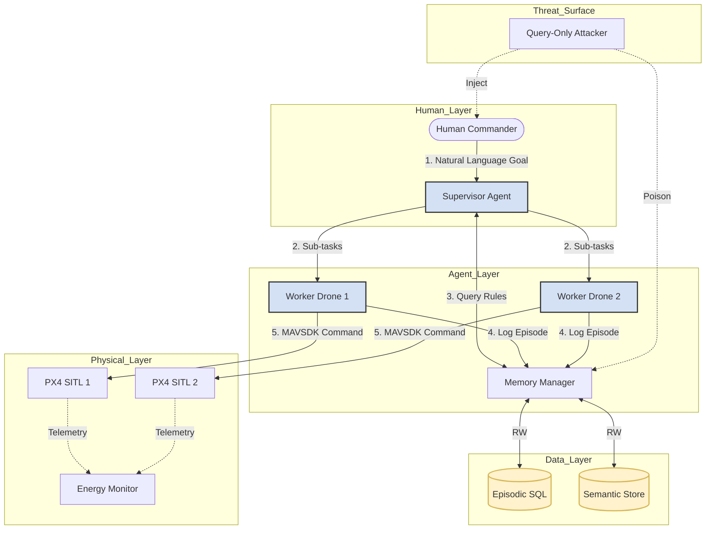

# Deliverable: Architecture & Design Specification (v1.0)
**Status:** Frozen
**Phase:** 2

## 1. System Architecture Diagram (Task 2.5)
*Action: Copy the code below into [Mermaid Live](https://mermaid.live) to generate your Figure 1. I have simplified the syntax to guarantee it renders without errors.*



---

## 2. Agent Responsibilities & Logic Flow (Task 2.1)

**1. Supervisor Agent (`supervisor_agent.py`)**
*   **Responsibility:** Strategic Planning.
*   **Logic:**
    1.  Input: "Scan region A and B."
    2.  *Step 1:* Tool Call -> `memory.query_semantic("Hazards in region A")`.
    3.  *Step 2:* Tool Call -> `memory.query_semantic("Energy cost for region A")`.
    4.  *Step 3:* Output -> List of sub-tasks: `[{"drone": 1, "task": "fly_to_A"}, {"drone": 2, "task": "fly_to_B"}]`.

**2. Worker Agents (`worker_agent.py`)**
*   **Responsibility:** Tactical Execution.
*   **Logic:**
    1.  Input: `{"task": "fly_to_A", "coords": [x,y]}`.
    2.  *Step 1:* Tool Call -> `mavsdk.check_battery()`.
    3.  *Step 2:* Tool Call -> `mavsdk.goto([x,y])`.
    4.  *Step 3:* Tool Call -> `memory.log_episode(success, battery_used)`.

**3. Memory Manager (`memory_manager.py`)**
*   **Responsibility:** Security & Storage.
*   **Logic:**
    1.  Receives write request from Worker.
    2.  **Phase 6 Defense Hook:** Calculates HMAC (Hash) of the data.
    3.  Writes to SQLite/ChromaDB.

---

## 3. Explicit Tool Interfaces (Task 2.2)

*Action: Create a file named `interfaces.py`. This defines exactly what your agents can do. This code is valid Python.*

```python
from typing import List, Dict, Optional
from dataclasses import dataclass

# --- MAVSDK Interface ---
class DroneController:
    """Interface for low-level drone control via MAVSDK."""
    
    def arm_and_takeoff(self, altitude: float) -> str:
        """Arms the drone and takes off to target altitude."""
        pass

    def goto_location(self, lat: float, lon: float, alt: float) -> str:
        """Fly to global coordinates (GPS)."""
        pass

    def get_telemetry(self) -> Dict[str, float]:
        """
        Returns: {
            'lat': float, 'lon': float, 
            'battery_soc': float (0.0-1.0), 
            'heading_deg': float
        }
        """
        pass

# --- Memory Interface ---
class MemoryInterface:
    """Interface for RAG (Retrieval Augmented Generation)."""

    def log_episode(self, 
                    drone_id: int, 
                    action: str, 
                    outcome: str, 
                    context_embedding: List[float]) -> bool:
        """
        Writes a raw experience to the Episodic DB.
        Defense Hook: This function will calculate the Integrity Tag.
        """
        pass

    def query_semantic_rules(self, query_text: str) -> List[Dict]:
        """
        Retrieves high-level rules (e.g., 'No-Fly Zone').
        Returns: [{'rule': 'Avoid Zone X', 'confidence': 0.9}]
        """
        pass
```

---

## 4. Database Schemas (Task 2.3)

*Action: These are the SQL table definitions you will use in Phase 4. Note the specific fields for Security (RQ2) and Energy (RQ1).*

**Table 1: `episodic_memory`**
*   `id` (INTEGER PRIMARY KEY)
*   `timestamp` (FLOAT): Simulation time.
*   `drone_id` (INTEGER): 1 or 2.
*   `mission_id` (TEXT): Grouping ID for the mission.
*   `state_json` (TEXT): `{"lat": ..., "lon": ..., "soc": ...}`.
*   `action` (TEXT): The command issued.
*   `outcome` (TEXT): Success/Fail/Crash.
*   `energy_delta` (FLOAT): Battery % consumed during this specific action.
*   **`integrity_mac`** (TEXT): **(Crucial for Defense)** SHA-256 Hash of (timestamp + state + action).

**Table 2: `semantic_rules`**
*   `id` (INTEGER PRIMARY KEY)
*   `rule_text` (TEXT): e.g., "High wind drain at coordinates X,Y".
*   `rule_type` (TEXT): "HAZARD" or "ENERGY".
*   **`support_ids`** (TEXT): JSON list of `episodic_memory.id` that prove this rule is true.
*   **`is_verified`** (BOOLEAN): **(Crucial for Defense)** True if cross-agent checks passed.

---

## 5. Energy Model Specification (Task 2.4)

You cannot rely solely on the PX4 battery simulator because it can be erratic. You need a formula for your paper's "Evaluation" section.

**The Formula:**
We define the Total Energy Cost ($E_{total}$) as:

$$E_{total} = \int_{0}^{T} P(t) dt \approx \sum_{i=0}^{N} (P_{hover} + k \cdot v_i^2) \cdot \Delta t$$

Where:
*   $P_{hover}$: Power required to hover (constant).
*   $v_i$: Velocity at step $i$.
*   $k$: Drag coefficient.

**Implementation Plan:**
In Phase 3, you will create a `DataLogger` class that writes a CSV every 1 second:
`timestamp, drone_id, flight_mode, velocity_x, velocity_y, velocity_z, battery_px4`

---

### How to Submit This Phase
1.  **Architecture:** Copy the Mermaid diagram image into your paper.
2.  **Design Doc:** Save the sections above (Responsibilities, Interfaces, Schemas, Energy) as `Design_Spec.pdf`.
3.  **Code Prep:** Create the `interfaces.py` file in your project folder.

**You are now ready to start Phase 3 (Coding the Baseline) without any design ambiguities.**
